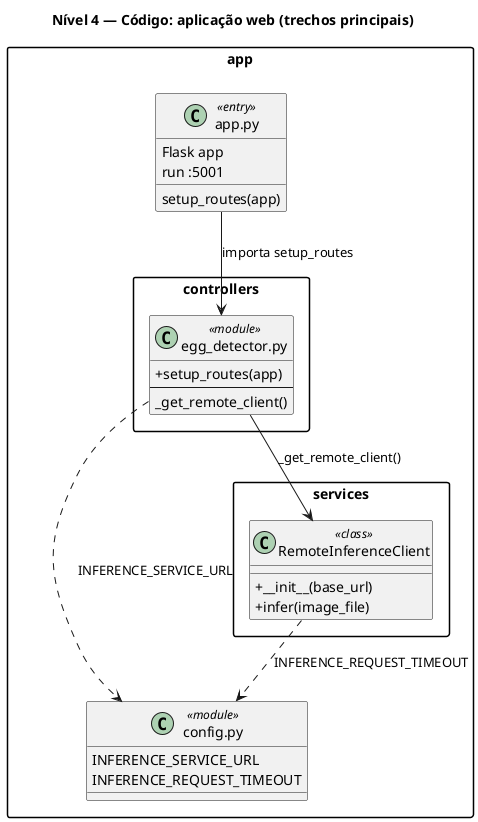
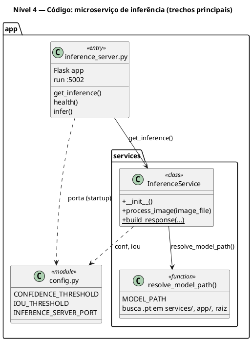

# C4 Model — Egg Candling AI

Este documento descreve a arquitetura do **Egg Candling AI** nos quatro níveis do [C4 model](https://c4model.com/): **Contexto**, **Contêineres**, **Componentes** e **Código**.

**Como renderizar os diagramas**

- **PlantUML** com a biblioteca [C4-PlantUML](https://github.com/plantuml-stdlib/C4-PlantUML) (níveis 1–3 usam `!include` remoto na tag **`v2.5.0`**, compatível com PlantUML mais antigo; o branch `master` do C4 exige **PlantUML ≥ 1.2023.8** por causa de `%chr()`).
- Extensões: VS Code / Cursor “PlantUML”, ou [plantuml.com](https://www.plantuml.com/plantuml) colando o bloco `@startuml` … `@enduml`.
- O **nível 4** está em diagramas de **classes PlantUML** (visão de código explícita; o C4 nível 4 costuma ser opcional e específico de um componente).

**Mensagem no painel: `dynamic undefined legend colors` … `PlantUML version >= 1.2021.6`**

Isso **não é falha do diagrama**. O C4-PlantUML detecta que o seu PlantUML **não tem** a função `%is_dark()` (versão **anterior a 1.2021.6**), usa **cores estáticas** na legenda e emite um `!log`. A extensão costuma mostrar esse log como **“Error found in diagram”**, mesmo com o desenho correto.

Para **sumir com o aviso**: aponte a extensão para um **`plantuml.jar` ≥ 1.2021.6** (de preferência o [último release](https://github.com/plantuml/plantuml/releases)).

**Erro `Unknow built-in function %chr`**

O branch **`master`** do C4-PlantUML exige **PlantUML ≥ ~1.2023.8**. Este projeto usa a tag **`v2.5.0`** do C4 para evitar `%chr` com JAR antigo; se você voltar a usar `master` no `!include`, atualize o JAR.

**Configurar um `plantuml.jar` novo (recomendado)**

1. Baixe o `.jar` nos [releases do PlantUML](https://github.com/plantuml/plantuml/releases) e guarde em pasta fixa (ex.: `~/bin/plantuml.jar`).
2. Cursor/VS Code: **Settings** → `plantuml` → **PlantUML: Jar** (`plantuml.jar`) → caminho absoluto do arquivo.
3. `java -version` no terminal deve funcionar.
4. Feche e reabra o preview (**PlantUML: Preview Current Diagram**).

Alternativa sem Java local: **PlantUML Server** nas opções da extensão, se disponível.

Variáveis e portas citadas: `INFERENCE_SERVICE_URL` (padrão `http://127.0.0.1:5002`), app web na porta **5001**, microserviço na **5002** (configurável via `INFERENCE_SERVER_PORT`).

---

## Nível 1 — Contexto (System Context)

Quem usa o sistema e para quê, sem detalhar tecnologia interna.

```plantuml
@startuml C4_L1_Context
!include https://raw.githubusercontent.com/plantuml-stdlib/C4-PlantUML/v2.5.0/C4_Context.puml

title Nível 1 — Contexto: Egg Candling AI

Person(operador, "Operador / produtor", "Realiza candling e precisa estimar fertilidade a partir de fotos de ovos.")

System(egg_ai, "Egg Candling AI", "Sistema que recebe imagens, executa inferência com IA e exibe fertilidade por ovo com confiança e imagem anotada.")

Rel(operador, egg_ai, "Envia imagens e consulta resultados", "Navegador (HTTP/HTTPS)")
@enduml
```

---

## Nível 2 — Contêineres (Containers)

Processos executáveis, armazenamento e canais entre eles.

```plantuml
@startuml C4_L2_Containers
!include https://raw.githubusercontent.com/plantuml-stdlib/C4-PlantUML/v2.5.0/C4_Container.puml

title Nível 2 — Contêineres: Egg Candling AI

Person(operador, "Operador", "Usuário humano")

System_Boundary(egg, "Egg Candling AI") {
    Container(web, "Aplicação Web", "Python, Flask", "UI server-side (Jinja2), Alpine.js no cliente; roteia upload e proxy de inferência.")
    Container(infer, "Microserviço de Inferência", "Python, Flask, Ultralytics YOLOv8, Pillow", "API HTTP: saúde e inferência; carrega modelo .pt; devolve JSON e imagem anotada (Base64).")
}

Rel(operador, web, "Utiliza", "HTTP (ex.: porta 5001 em dev)")
Rel(web, infer, "Encaminha imagem e recebe resultado", "HTTP POST /infer (multipart); URL via INFERENCE_SERVICE_URL")
@enduml
```

---

## Nível 3 — Componentes (Components)

Componentes **dentro** de cada contêiner e relações entre eles.

### 3.1 Dentro da aplicação web

```plantuml
@startuml C4_L3_Web_Components
!include https://raw.githubusercontent.com/plantuml-stdlib/C4-PlantUML/v2.5.0/C4_Component.puml

title Nível 3 — Componentes: Aplicação Web

Container_Ext(infer, "Microserviço de Inferência", "Flask", "POST /infer, GET /health")

Person(operador, "Operador", "Usuário")

Container_Boundary(web, "Aplicação Web") {
    Component(view, "Templates e estáticos", "Jinja2, HTML, CSS, Alpine.js", "home.html, app.html, base.html; fluxo de upload e câmera.")
    Component(ctrl, "Controlador Flask", "Python", "controllers/egg_detector.py — rotas /, /app, POST /infer.")
    Component(remote, "RemoteInferenceClient", "Python, requests", "Cliente HTTP com pool; timeout INFERENCE_REQUEST_TIMEOUT.")
    Component(cfg_web, "config (uso web)", "Python", "INFERENCE_SERVICE_URL e timeout; importado pela app web.")
}

Rel(operador, view, "Interage", "Navegador")
Rel(view, ctrl, "Dispara ações", "HTTP (ex.: POST /infer com multipart)")
Rel(ctrl, remote, "infer(image_file)", "Python")
Rel(ctrl, view, "render_template", "HTML")
Rel(remote, infer, "POST /infer", "JSON")
Rel(ctrl, cfg_web, "Lê URL base", "import")
Rel(remote, cfg_web, "Lê timeout", "import")
@enduml
```

### 3.2 Dentro do microserviço de inferência

```plantuml
@startuml C4_L3_Infer_Components
!include https://raw.githubusercontent.com/plantuml-stdlib/C4-PlantUML/v2.5.0/C4_Component.puml

title Nível 3 — Componentes: Microserviço de Inferência

Container_Boundary(infer, "Microserviço de Inferência") {
    Component(api, "API Flask", "Python, Flask", "inference_server.py — rotas GET /health, POST /infer; inicialização lazy do serviço.")
    Component(svc, "InferenceService", "Python, Ultralytics, PIL", "inference_service.py — YOLO, pós-processamento, desenho das caixas, Base64 PNG.")
    Component(cfg_infer, "config (uso inferência)", "Python", "CONFIDENCE_THRESHOLD, IOU_THRESHOLD, INFERENCE_SERVER_PORT.")
    Component(model, "Artefato do modelo", "Arquivo .pt", "egg_detection_yolov8n_final.pt (ou caminho via MODEL_PATH).")
}

Rel(api, svc, "process_image(); build_response()", "Python")
Rel(svc, cfg_infer, "Lê limiares YOLO", "import")
Rel(api, cfg_infer, "Lê porta (startup)", "import")
Rel(svc, model, "Carrega pesos", "YOLO(model_path)")
@enduml
```

---

## Nível 4 — Código (Code)

Visão dos **elementos de implementação** principais (módulos/classes/funções) alinhados ao repositório. Dois diagramas: **web** e **inferência**.

### 4.1 Aplicação web



### 4.2 Microserviço de inferência



---

## Legenda rápida C4

| Nível | Pergunta que responde |
|-------|------------------------|
| **1 — Contexto** | Quem usa o sistema e como se relaciona com ele? |
| **2 — Contêineres** | Quais aplicações/serviços existem e como conversam? |
| **3 — Componentes** | Como cada contêiner é decomposto em partes lógicas? |
| **4 — Código** | Como classes/módulos implementam um componente? (escopo reduzido) |

---

## Referência de arquivos (mapeamento)

| Conceito C4 | Caminho no repositório |
|-------------|-------------------------|
| Entrada web | `app/app.py` |
| Controlador | `app/controllers/egg_detector.py` |
| Cliente HTTP | `app/services/inference_remote.py` |
| Entrada inferência | `app/inference_server.py` |
| Lógica YOLO + desenho | `app/services/inference_service.py` |
| Config compartilhada | `app/config.py` |
