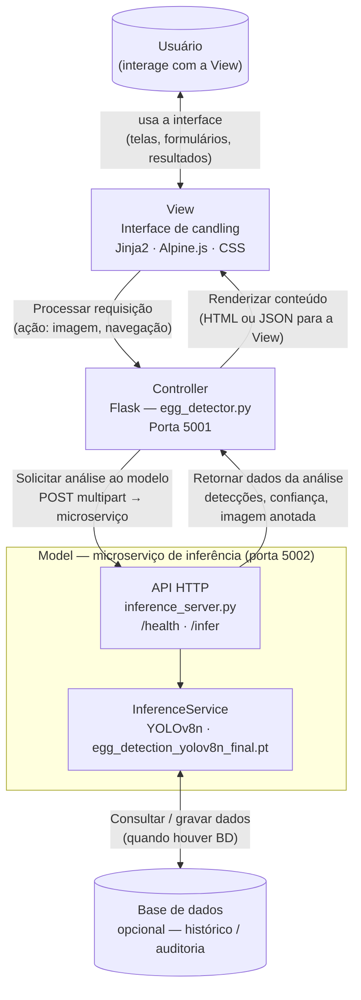

# Documentação do sistema — Egg Candling AI

## 1. Objetivo e descrição

O **Egg Candling AI** é um sistema web para apoiar a **transluscência (candling)** de ovos: a partir de **fotos** tiradas em condições controladas de iluminação, o sistema indica, com **caixas delimitadoras** e **rótulos**, se cada ovo detectado tende a ser **fértil** ou **infértil**, com um **nível de confiança** associado. A solução separa a **interface e orquestração** (aplicação web Flask) do **processamento de IA** (**microserviço HTTP**), permitindo **monitoramento e deploy independentes** do serviço de inferência.

---

## 2. Funcionalidades

| Funcionalidade | Descrição |
|----------------|-----------|
| **Página inicial** | Apresentação do produto e acesso à área de análise. |
| **Área de análise** | Fluxo dedicado para envio de imagem e visualização de resultados. |
| **Upload de imagem** | Seleção de arquivo de imagem no dispositivo (limites de tipo/tamanho tratados no cliente e no servidor). |
| **Captura por câmera** | Uso da câmera do navegador para fotografar o ovo e enviar para análise. |
| **Inferência remota** | A app web encaminha a imagem ao **microserviço de IA** via HTTP (`multipart`). |
| **Resultados** | Lista de detecções (classe, confiança, caixa), resumo por contagem e **imagem anotada** (Base64) para exibição. |
| **Saúde do microserviço** | Endpoint `GET /health` no serviço de inferência para probes e monitoramento. |

---

## 3. Tecnologias utilizadas

### 3.1 Aplicação web (visão geral)

| Camada | Tecnologias |
|--------|-------------|
| **Servidor** | Python, **Flask**, **Werkzeug**, **Flask-CORS** |
| **Integração** | **Requests** (cliente HTTP), variáveis de ambiente (`INFERENCE_SERVICE_URL`, timeouts) |
| **Apresentação** | **Jinja2** (templates), **HTML5** |
| **Cliente (UI)** | **Alpine.js**, **UnoCSS** (runtime), **CSS** próprio (`main.css`), **Font Awesome** |

### 3.2 Microserviço de inferência

| Componente | Tecnologias |
|------------|-------------|
| **API** | **Flask** (rotas `GET /health`, `POST /infer`) |
| **Modelo** | **YOLOv8** via biblioteca **Ultralytics** (sobre **PyTorch**) |
| **Imagem** | **Pillow (PIL)** — leitura, conversão RGB, desenho das caixas e exportação para resposta |
| **Artefato** | Arquivo de pesos **`.pt`** (ex.: `egg_detection_yolov8n_final.pt`) |

### 3.3 Dependências Python (referência)

Instalação unificada: `requirements.txt` na raiz do repositório (inclui pacotes da web e do microserviço para desenvolvimento local).

---

## 4. Serviço de IA — problema, natureza e modelo

### 4.1 Problema de negócio

Auxiliar na **identificação da fertilidade** em ovos submetidos à candling, reduzindo subjetividade e padronizando a leitura a partir de **imagens digitais**.

### 4.2 Natureza do problema (visão de ML)

Trata-se de um problema de detecção e classificação: primeiramente o modelo detecta objeto e em seguida realiza a classificação atribuindo uma **classe** entre pelo menos **fértil** e **infértil**. Em outras palavras: **localização + classificação** por instância detectada.

### 4.3 Modelo e pipeline

| Aspecto | Detalhe |
|---------|---------|
| **Família** | **YOLOv8** (Ultralytics), variante **nano** (`yolov8n`) quando aplicável ao arquivo `egg_detection_yolov8n_final.pt` |
| **Entrada** | Imagem (arquivo enviado em `POST /infer`) |
| **Saída** | Coordenadas das caixas, classe por detecção, confiança; imagem com anotações codificada em **Base64** (PNG) no JSON |
| **Hiperparâmetros expostos em código** | `CONFIDENCE_THRESHOLD`, `IOU_THRESHOLD` em `app/config.py` |
| **Resolução do arquivo `.pt`** | Variável de ambiente `MODEL_PATH` ou busca em `app/services/`, `app/` ou raiz do repositório |

O microserviço **não** substitui avaliação veterinária ou protocolos oficiais de incubatório; é uma **ferramenta de apoio** à decisão.

---

## 5. Arquitetura MVC e microserviço de IA

Adotamos o **conceito clássico de MVC**, **adaptado ao contexto de candling** e à nossa nomenclatura. Aqui, o **Model** não é só uma classe na app web: ele **realiza-se** no **microserviço de inferência** (processo HTTP separado), que concentra o **modelo YOLOv8**, o arquivo **`.pt`** e, no futuro, a **persistência** dos resultados.

### 5.1 Componentes (nossa nomenclatura)

| Conceito MVC | No Egg Candling AI |
|--------------|-------------------|
| **Usuário** | Produtor / operador que usa o sistema (navegador). |
| **View** | Camada de apresentação: templates **Jinja2** (`base`, `home`, `app`), **Alpine.js**, CSS e fluxo de upload/câmera. |
| **Controller** | **Flask** — módulo `egg_detector.py`: rotas `/`, `/app`, `/infer`; valida a requisição e orquestra a chamada ao modelo. |
| **Model** | **Modelo de domínio da análise**, implementado pelo **microserviço** (`inference_server.py` + `InferenceService`): inferência **YOLOv8n**, pós-processamento e JSON de resposta. O Controller fala com o Model via **`RemoteInferenceClient`** (HTTP). |
| **Base de dados** | **Opcional / evolução** — armazenamento de histórico de análises, metadados de imagens, etc. O código atual pode operar sem BD; o diagrama mantém o elo *Model ↔ BD* como no MVC canônico. |

### 5.2 Diagrama — mesmo fluxo conceitual do MVC clássico

Legendas dos rótulos alinhadas ao que se vê nos materiais de *Request process*, *Render content*, *Asking model…*, *Returning the data*, *Asking DB…* — aqui em português e com o nosso vocabulário.

### 5.3 Passos resumidos (análise de imagem)

1. **Usuário** age na **View** (upload ou câmera).
2. **View** envia a requisição ao **Controller** (`POST /infer` na app web).
3. **Controller** chama o **Model** (microserviço) via cliente HTTP.
4. **Model** executa **YOLOv8**, opcionalmente interage com **BD** no futuro, e **retorna os dados** ao Controller.
5. **Controller** **renderiza/atualiza** a **View** com o resultado (JSON consumido pelo Alpine).

---

## 6. Referência rápida de arquivos

| Arquivo / pasta | Papel |
|-----------------|--------|
| `app/app.py` | Ponto de entrada da aplicação web |
| `app/inference_server.py` | Ponto de entrada do microserviço de inferência |
| `app/controllers/egg_detector.py` | Controller (rotas) |
| `app/services/inference_remote.py` | Cliente HTTP para o microserviço |
| `app/services/inference_service.py` | Lógica de inferência e desenho (usada pelo microserviço) |
| `app/config.py` | Limiares YOLO e URL do microserviço |
| `env.example` | Exemplo de variáveis de ambiente |

---
